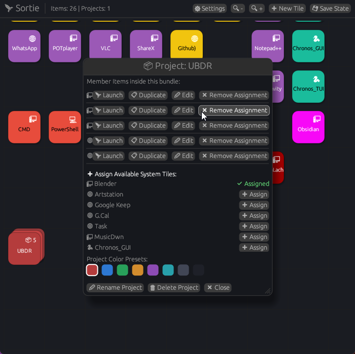
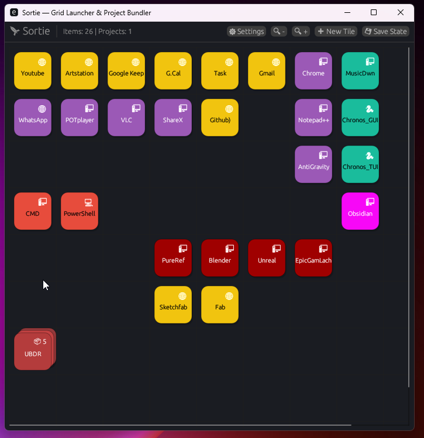
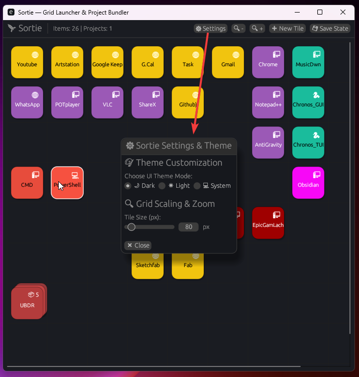
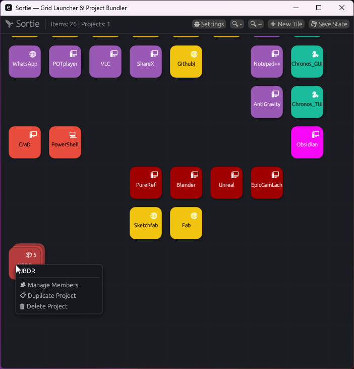
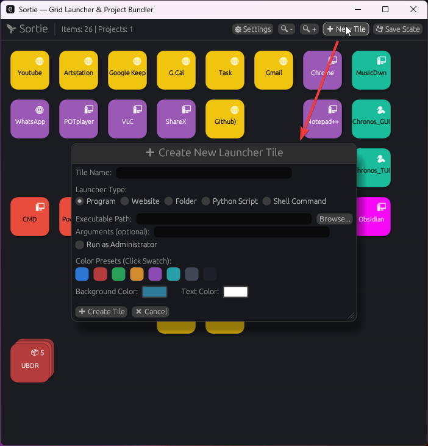
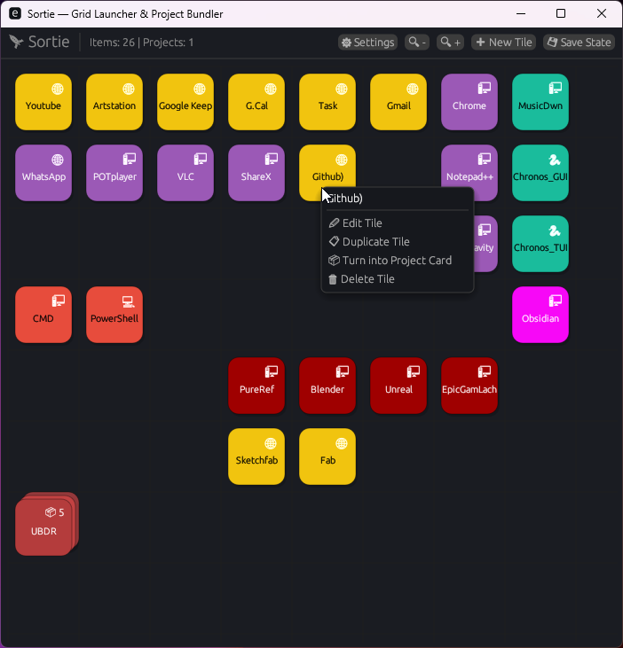

# Sortie — Desktop Grid Launcher & Project Bundler 🚀

<div align="center">








**A native, lightning-fast Rust desktop grid launcher and workflow automator designed to organize your apps, websites, folders, scripts, and bundle them into 1-click Project Workspaces.**

[](https://www.rust-lang.org/)
[](https://github.com/emilk/egui)
[](https://www.microsoft.com/)
[](#license)

---

**Searchable Tags & Topics:**  
`#rust` `#egui` `#launcher` `#desktop` `#productivity` `#windows` `#project-manager` `#automation` `#gui` `#taskbar` `#shortcut-manager` `#bundle-launcher` `#workflow` `#open-source` `#tools`

</div>

---

## ✨ Overview

**Sortie** solves the clutter of modern desktop workflows. Instead of hunting through messy desktop shortcuts, taskbars, or browser bookmarks whenever you start a creative or technical project, Sortie brings everything into a clean, highly customized **Interactive Grid Dashboard**.

Whether you are launching a complex 3D animation suite (`Blender` + `ArtStation` + `Project Folder` + `Custom Python Pipeline`), a coding workspace, or daily productivity tools, **Sortie** lets you group your tools into **Project Cards** and fire off all necessary applications with **a single click**.

---

## 🔥 Key Features

### 🧩 1. Dynamic Grid Dashboard & Custom Aesthetics
- **Grid Workspace:** Organize your tiles across a clean grid with adjustable zoom levels (`🔍 Zoom In/Out`) and auto-flow alignment.
- **Tailored Color Presets:** Customize tile background and text colors using curated 1-click swatches (*Royal Blue*, *Crimson Red*, *Emerald Green*, *Sunset Orange*, *Amethyst Purple*, *Teal*, *Slate Gray*, *Dark Charcoal*) or precise RGBA color pickers.
- **Dual Theme Support:** Toggle seamlessly between sleek **Dark Mode** and crisp **Light Mode**.

### 🛠️ 2. Versatile Launcher Kinds
Every tile in Sortie is a specialized launcher capable of running different system actions:
- 🖥️ **Programs & Executables (`.exe`)**: Launch applications with custom command-line arguments (`--args`) and toggle **"Run as Administrator"** permissions.
- 🌐 **Websites & URLs**: Instantly open web apps, cloud dashboards, documentation, or reference boards (`https://...`) in your default browser.
- 📁 **Folders & Directories**: Open native Windows File Explorer directly to your project roots or asset directories.
- 🐍 **Python Scripts (`.py`)**: Execute Python scripts right from your dashboard using custom virtual environment interpreters (`python`, custom `.venv/Scripts/python.exe`, etc.).
- 💻 **Shell Commands**: Run custom terminal pipelines using **Command Prompt** (`cmd /C`) or **PowerShell** (`powershell -Command`).

### 📦 3. Smart Project Bundlers (`Project Cards`)
- **Bundle & Launch All:** Group related tools into a single **Project Card**. Click **`🚀 Launch All`** to launch every application, folder, and website inside that project simultaneously!
- **Non-Destructive Multi-Membership:** Master tiles on your grid never get consumed or locked to a single project. A single tool (`Blender`, `Folder 1`, or `Notepad`) can belong to **Project A**, **Project B**, and **Project C** at the exact same time!
- **Manage Members In-Situ:** Double-click or right-click any Project Card (`👥 Manage Members`) to assign new tiles, remove assignments, or launch individual members without leaving the project overview.

### ✏️ 4. Instant Tile Editing & Customization
- **Right-Click Edit Tile:** Right-click any tile directly on the grid and select **`✏ Edit Tile`** to modify names, target paths, parameters, or colors on the fly.
- **Edit Inside Projects:** Need to tweak a tool path from inside a project? Click the **`[✏ Edit]`** button directly inside the **`👥 Manage Members`** project modal!

### 📋 5. One-Click Duplication & Auto-Rename
- **Duplicate Tiles & Projects:** Right-click any tile (`📋 Duplicate Tile`) or project card (`📋 Duplicate Project`) to create an immediate independent copy.
- **Intelligent Name Clash Resolution:** If a tile named `Blender` is duplicated, Sortie automatically assigns a clean non-clashing name (`Blender (Copy)` $\rightarrow$ `Blender (Copy 2)` $\rightarrow$ `Blender (Copy 3)`).
- **Duplicate Right Into Projects:** Inside `👥 Manage Members`, click **`[📋 Duplicate]`** on an existing member to duplicate the master tile onto the grid and automatically assign the new copy right into your active project card.

### 🖱️ 6. Native OS Drag-and-Drop Ingestion
- Drag any `.exe`, `.py` script, folder, or `.url`/shortcut straight from Windows File Explorer and drop it onto the Sortie window to automatically ingest and create a properly typed launcher tile!

### ⚡ 7. Zero-Overhead & Standalone Windows `.exe`
- **Instant Startup (<15ms):** Built entirely in Rust using `eframe`/`egui`. No Electron overhead, no heavy webviews, no background RAM bloat.
- **Standalone Binary (`sortie.exe`):** Compiles into a single portable GUI executable with zero background console popup (`windows_subsystem = "windows"`).
- **Automatic Persistence:** Your dashboard layout, tiles, projects, and color settings are automatically saved and synced to your local OS config (`%APPDATA%\Sortie\state.json`).

---

## 📸 Screenshots Showcase

| **Main Dashboard Grid & Project Cards** | **Project Workspace & Member Management** |
| :---: | :---: |
|  |  |

| **Interactive Modals & Custom Swatches** | **Native File Explorer Handoff** |
| :---: | :---: |
|  |  |

---

## 🚀 Quickstart & Installation

### Prerequisites
- **OS:** Windows 10 / 11
- **Toolchain:** [Rust & Cargo](https://rustup.rs/) (2021 Edition or newer)

### 1. Clone the Repository
```powershell
git clone https://github.com/photonsX/Sortie.git
cd Sortie
```

### 2. Build for Production (Release Mode)
```powershell
cargo build --release
```
This builds your standalone GUI application at:
```text
target\release\sortie.exe
```

### 3. Run Sortie
```powershell
cargo run --release
```
*or simply double-click `target\release\sortie.exe` from File Explorer!*

---

## 📌 Creating Desktop & Taskbar Shortcuts

To make Sortie your primary daily launcher:
1. Navigate to `target\release\` in File Explorer.
2. Right-click **`sortie.exe`** $\rightarrow$ **Send to $\rightarrow$ Desktop (create shortcut)**.
3. Rename your desktop shortcut to **`Sortie`**.
4. Right-click the running **Sortie** icon on your Windows Taskbar and select **`Pin to taskbar`** for instant 1-click access anytime!

---

## 🏗️ Project Architecture

```text
Sortie/
├── Sortie-screenshots/       # Visual showcase and UI snapshots
├── src/
│   ├── app.rs                # Core eframe GUI lifecycle & top-level UI loops
│   ├── main.rs               # Native GUI entry point & window settings
│   ├── launch/               # Execution dispatching & OS drag-and-drop parsing
│   │   ├── dispatch.rs       # Program, Website, Folder, Script & Shell launchers
│   │   └── dropped.rs        # OS drag-and-drop payload ingestion
│   ├── model/                # Core domain state & serialization
│   │   ├── item.rs           # Tile item structs & LauncherKind enum definitions
│   │   ├── project.rs        # Project Card structures & multi-member IDs
│   │   └── state.rs          # AppState persistence, auto-rename & grid resolution
│   └── ui/                   # Modular egui renderers
│       ├── grid.rs           # Interactive grid canvas, drag-and-drop & context menus
│       ├── modal.rs          # Create, Edit, Project Members & Settings modals
│       └── toast.rs          # Non-blocking notification banner overlays
└── tests/
    └── model_tests.rs        # Comprehensive automated unit & integration test suite
```

---

## 🧪 Automated Testing

Sortie includes a rigorous automated test suite covering serialization round-trips, grid cell allocation, drag-and-drop parsing, non-destructive project dissolution, and auto-rename duplication resolution.

Run the test suite anytime:
```powershell
cargo test
```

---

## 🤝 Contributing & Customization

Contributions, bug reports, and feature requests are welcome!
1. Fork the project
2. Create your feature branch (`git checkout -b feature/AmazingFeature`)
3. Commit your changes (`git commit -m 'Add some AmazingFeature'`)
4. Push to the branch (`git push origin feature/AmazingFeature`)
5. Open a Pull Request

---

## 📜 License

Distributed under the **MIT License**. See `LICENSE` for more information.

---

<div align="center">
<b>Built with ❤️ by <a href="https://github.com/photonsX">photonsX</a></b>
</div>
